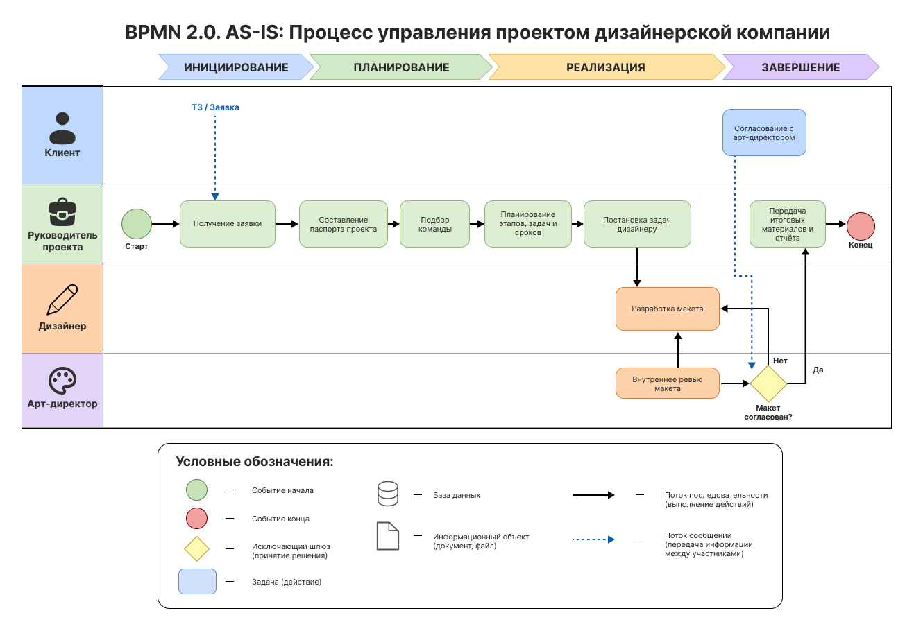
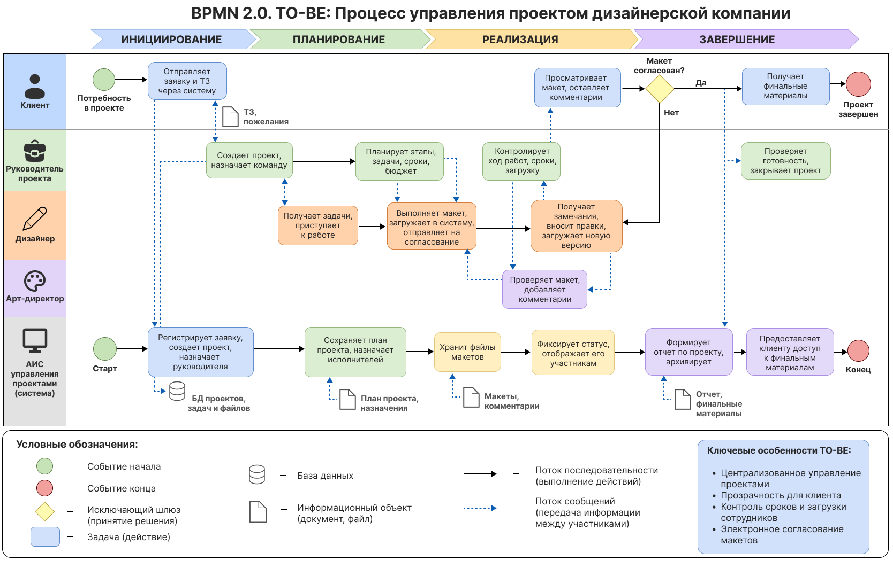
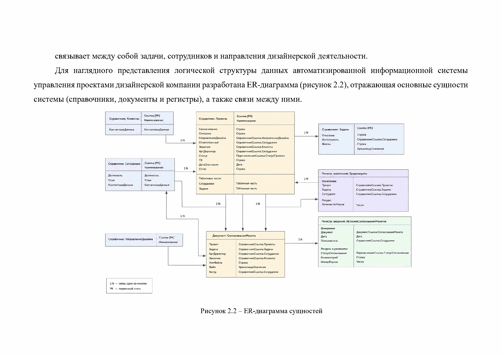
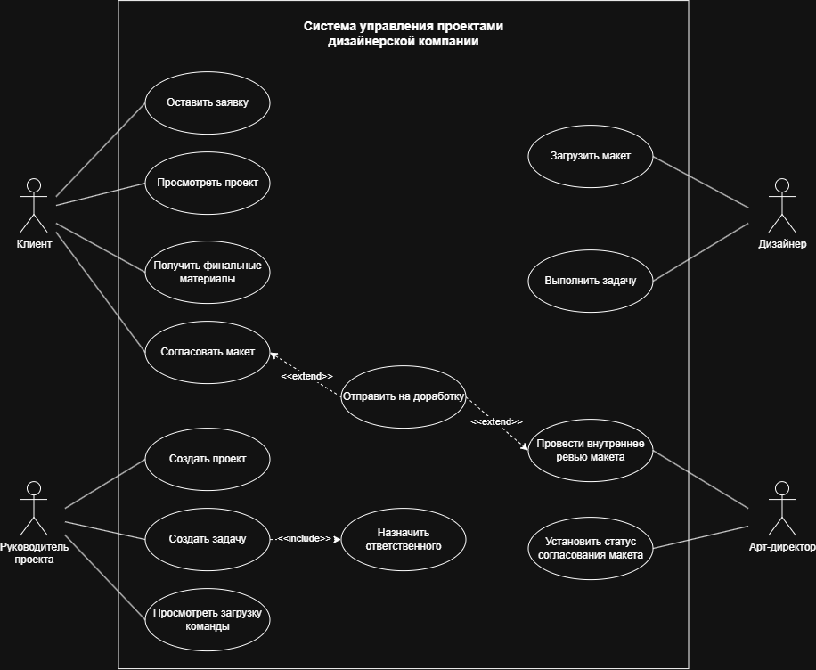

# 🎯 Design Project Management System


> **TL;DR:** Полный аналитический пакет для системы управления проектами дизайнерской компании — от полевого исследования (42 респондента) и BPMN-моделирования процессов до реляционной модели данных, API-контракта и расчёта экономического эффекта (~340 000 ₽/год). Основано на моей защищённой ВКР.

Пет-проект в портфолио **бизнес/системного аналитика**, основанный на выпускной квалификационной работе «Разработка автоматизированной информационной системы управления проектами дизайнерской компании» (САФУ им. М.В. Ломоносова, 2026).

**Оригинал** реализован на платформе **1С:Предприятие 8.3** — проприетарной российской ERP-платформе. Здесь модель данных и бизнес-процессы **переосмыслены и реализованы на открытом стеке** (PostgreSQL, SQL), чтобы быть понятными и переносимыми вне контекста 1С.

**Роль в проекте:** бизнес-анализ, системный анализ, проектирование данных и процессов
**Инструменты:** BPMN 2.0 · UML · ER-диаграмма · SQL / PostgreSQL · Swagger / OpenAPI
**Статус:** готов к демонстрации

📄 Автор: Роман Каращук — [резюме на hh.ru](https://arkhangelsk.hh.ru/resume/83f764d9ff107fc0da0039ed1f6d5572526677) · [Telegram](https://t.me/Grzegorzio) · 🇬🇧 [English summary](README.en.md)

---

## 1. Постановка задачи

**Исследование:** анализ бизнес-процессов дизайнерских компаний г. Архангельска и онлайн-опрос 42 специалистов отрасли (дизайнеры, арт-директора, руководители проектов), март 2026.

**Проблема:** процессы фрагментированы —

- согласование макетов идёт через почту/мессенджеры (24,8% опрошенных называют это главной проблемой);
- нет единой истории коммуникаций (81%);
- файлы теряют версии (28,6%);
- не ведётся учёт трудозатрат (14,9%).

90,5% респондентов подтвердили необходимость единой системы.

**Цель:** спроектировать систему, устраняющую эти проблемы, и подготовить полный аналитический пакет — от исследования до модели данных.

Полное ТЗ — [`docs/requirements/tz.md`](docs/requirements/tz.md).

## 2. Функциональные требования

Сформированы в формате user story, приоритизированы по MoSCoW — [`docs/requirements/functional-requirements.md`](docs/requirements/functional-requirements.md).

Ключевые сценарии: руководитель проекта управляет задачами и сроками; дизайнер загружает макеты с версионностью; арт-директор согласовывает макеты со статусами «На согласовании» / «Утверждено» / «Требует правок»; клиент видит статус проекта и получает финальные материалы.

## 3. Бизнес-процессы (BPMN 2.0)

**AS-IS** — заявка и согласование идут вручную (почта, Excel, мессенджеры), макет проходит внутреннее ревью у арт-директора без фиксации истории решений.



**TO-BE** — все действия, от заявки клиента до финального архива, проходят через систему; статусы, комментарии и версии фиксируются централизованно.



## 4. Модель данных (ER-диаграмма)

Адаптированная реляционная модель для PostgreSQL:


| Таблица | Назначение | Ключевые поля |
|---|---|---|
| `users` | Авторизация | `login`, `password_hash`, `role` |
| `clients` | Клиенты (юрлица) | `company_name`, `inn`, `email`, `phone` |
| `employees` | Сотрудники (в т.ч. арт-директора) | `full_name`, `position` |
| `projects` | Проекты | `name`, `client_id`, `status`, `start_date`, `end_date` |
| `tasks` | Задачи | `project_id`, `assignee_id`, `title`, `status`, `due_date` |

**Связи:**
```
users 1───1 clients 1───N projects 1───N tasks N───1 employees 1───1 users
```

DDL-скрипты — в [`db/migrations`](db/migrations). Аналитические SQL-запросы (джоины, агрегаты, оконные функции, CTE) — в [`db/queries/analytics.sql`](db/queries/analytics.sql).

<details>
<summary>Оригинальная ER-диаграмма на объектах 1С (справочники, документы, регистры) + чем отличается адаптация</summary>



В 1С-версии версионность макетов и согласование вынесены в отдельный документ `СогласованиеМакета` и регистр сведений `ИсторияСогласованияМакетов`, трудозатраты — в регистр накопления. В адаптации это упрощено до статусной модели `tasks.status` — для полного соответствия оригиналу можно добавить таблицы `mockup_versions` и `time_entries` (см. раздел «Возможные доработки»).

</details>

## 5. Диаграмма вариантов использования (UML)



**Ключевые роли:**

- **Клиент** — заявка, согласование, получение материалов
- **Руководитель проекта** — управление задачами и командой
- **Дизайнер** — загрузка макетов
- **Арт-директор** — внутреннее ревью и согласование

## 6. REST API

> Ниже — спроектированный API-контракт (OpenAPI-спецификация), а не развёрнутый сервис. Задача этого раздела — смоделировать интеграционный слой системы на основе бизнес-требований.

Описание и примеры запросов — [`docs/API/README.md`](docs/API/README.md), полная спецификация — [`docs/API/openapi.yaml`](docs/API/openapi.yaml).

## 7. Оценка экономического эффекта

Расчёт из исследовательского раздела ВКР — методика, формулы и исходные данные в [`docs/economic-effect.md`](docs/economic-effect.md).

| Показатель | Значение |
|---|---|
| Сокращение времени согласования | до 70% (подтверждённая гипотеза исследования) |
| Чистый годовой эффект | 340 000 ₽/год |
| Срок окупаемости | ~18 месяцев |

*Методика: сравнение трудозатрат на согласование до/после внедрения на основе хронометража проектов и опроса респондентов — полный расчёт по ссылке выше.*

---

## Структура репозитория

```
design-project-management-system/
├── README.md
├── README.en.md
├── docs/
│   ├── API/
│   │   ├── README.md
│   │   └── openapi.yaml
│   ├── requirements/
│   │   ├── tz.md
│   │   └── functional-requirements.md
│   ├── BPMN/
│   │   ├── approval-as-is.png
│   │   └── approval-to-be.png
│   ├── UML/
│   │   └── use_case.png
│   ├── er-diagram.png
│   ├── er-diagram-original.png
│   └── economic-effect.md
└── db/
    ├── migrations/
    │   ├── 001_create_users.sql
    │   ├── 002_create_clients.sql
    │   ├── 003_create_employees.sql
    │   ├── 004_create_projects.sql
    │   └── 005_create_tasks.sql
    ├── queries/
    │   └── analytics.sql
    └── schema.sql
```

## Как читать этот репозиторий

1. **`docs/requirements/tz.md`** — постановка задачи и требования
2. **`docs/BPMN/`** — как процесс работает сейчас и как будет работать
3. **`docs/er-diagram.png` + `db/`** — как процесс лёг на модель данных
4. **`docs/UML/use_case.png`** — как процесс распределяет функционал между ролями
5. **`db/queries/analytics.sql`** — аналитические запросы к данным
6. **`docs/API/openapi.yaml`** — контракт интеграции в стиле REST
7. **`docs/economic-effect.md`** — обоснование эффекта от внедрения

## Возможные доработки

- [ ] Диаграмма последовательности (UML) для ключевых сценариев согласования
- [ ] Таблица `mockup_versions` — версионность макетов как отдельная сущность (в оригинале — документ `СогласованиеМакета`)
- [ ] Таблица `time_entries` — тайм-трекинг по задачам (в оригинале — регистр накопления «Трудозатраты»)
- [ ] Роль арт-директора как отдельный этап согласования, а не просто `employees.position`
- [ ] Диаграмма состояний (state machine) для статусной модели задач и проектов

## Источник

Материал основан на моей ВКР «Разработка автоматизированной информационной системы управления проектами дизайнерской компании», защищённой в САФУ им. М.В. Ломоносова. Оригинальная система реализована на 1С:Предприятие 8.3; данный репозиторий — адаптация модели данных и бизнес-процессов под открытый стек для портфолио.
